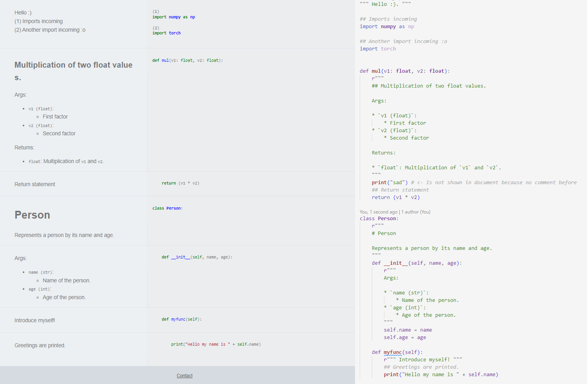

# PyDoc :snake: :page_facing_up:
> Tool for auto-generating documentation from python files.

Documentation style is highly inspired by (*).

## :eyes:	Example
**Single file processing**
```python
from PyDoc import pydoc

# Single file processing
pydoc(r"demo/single_file/example.py", r"demo/single_file/example.html")
```


**Directory processing**
```python
from PyDoc import pydoc

# Directory processing
pydoc_runner(
    root_src=r"demo/directory",
    root_doc=r"demo/doc"
)
```

## :confused: What's happening?
* Splits a python file into documentation and code segments.
* Comments within the code are distinguished between 'inside' and 'outside' comments.
    * Inside comments are comments placed with # 
    * Outside comments are commented surrounded with r""" / """
* Each `def` and `class` is documented. To put comments to these definition use outside comments after the `def` or `class` header. 
* Inside a `def` or `class` body code is only document if an inside comment was placed before. If so, the code until an "empty" line is documented.
* All comments are parsed to Markdown. Remember that if you place two `inside` comments one below the other. The text is than parsed to an one-liner. If you want to create a newline with `inside` comments just add an empty line between both.
* You can create a documentation for your whole project / source directory by calling the pydoc_runner. It will create for each level an index.html listing all the subfolder and parsed python files. Just try it out and you will se what I mean :).

## :cry:	Known issues
The thing is that this script was only meant to be a side project to create a basic documentation for my other private stuff. Since I thought this could be helpful for others, I decided to make the code public anyways. Even though the script itself has some hardcoded and ugly parts. 

I think, if I can spare some time, I will try to improve it with time.


## :eyes:	Prerequisites

* markdown
* markdown-mdx_math
* pygments
* katex (not required, since CDN loaded)


<!-- CONTRIBUTING -->
## :writing_hand:	Contributing

Contributions are what make the open source community such an amazing place to learn, inspire, and create. Any contributions you make are **greatly appreciated**.

If you have a suggestion that would make this better, please fork the repo and create a pull request. You can also simply open an issue with the tag "enhancement".
Don't forget to give the project a star! Thanks again!

1. Fork the Project
2. Create your Feature Branch (`git checkout -b feature/AmazingFeature`)
3. Commit your Changes (`git commit -m 'Add some AmazingFeature'`)
4. Push to the Branch (`git push origin feature/AmazingFeature`)
5. Open a Pull Request


## References

Appreciate the great work from the following repositories:

- [labmlai](https://github.com/labmlai/annotated_deep_learning_paper_implementations)*

## :email: Contact	

If you have questions or remarks, feel free to create an issues or contact me via [email](mailto:t.buechler@outlook.com).
